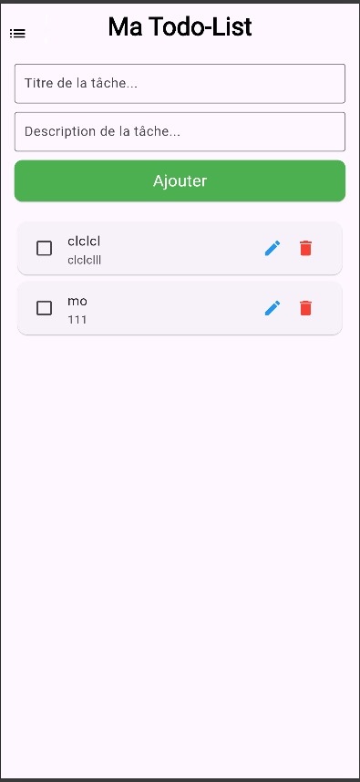
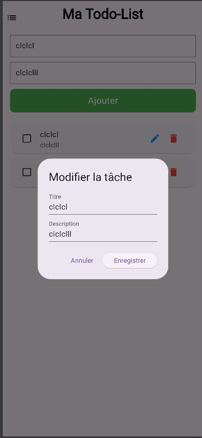

# todolist
 application  web pour la gestion des taches développé en flutter par Mo Nasser
Une application de gestion de tâches (todo list) développée avec Flutter, permettant d'ajouter, modifier, marquer comme terminée et supprimer des tâches.

## Fonctionnalités

- Ajouter une nouvelle tâche avec un titre et une description.
- Modifier une tâche existante.
- Marquer une tâche comme terminée ou non terminée.
- Supprimer une tâche.
- Affichage des tâches dans une liste avec leur statut de complétion.

## Installation

### Prérequis

- Flutter SDK installé sur votre machine.
- Android Studio ou VS Code pour le développement Flutter.

### Étapes d'installation

1. Clonez ce dépôt :
    ```bash
    git clone https://github.com/votre-nom/utiliser-flutter-todolist.git
    ```

2. Accédez au répertoire du projet :
    ```bash
    cd utilser-flutter-todolist
    ```

3. Installez les dépendances :
    ```bash
    flutter pub get
    ```

4. Lancez l'application sur un émulateur ou un appareil connecté :
    ```bash
    flutter run
    ```

## Capture d'écran

Voici quelques captures d'écran de l'application pour vous donner un aperçu de l'interface.

### Écran principal


### Ajouter une tâche



### Modifier une tâche



## Technologies utilisées

- **Flutter** pour le développement mobile.
- **Firebase Firestore** pour la gestion des données backend.

## Contribution

1. Fork ce projet.
2. Créez une branche (`git checkout -b feature-nouvelle-fonctionnalite`).
3. Effectuez vos modifications et ajoutez des tests si nécessaire.
4. Faites un commit de vos changements (`git commit -m 'Ajoute une nouvelle fonctionnalité'`).
5. Poussez votre branche (`git push origin feature-nouvelle-fonctionnalite`).
6. Créez une Pull Request.

## License

Distribué sous la licence MIT. Voir le fichier [LICENSE](LICENSE) pour plus de détails.
